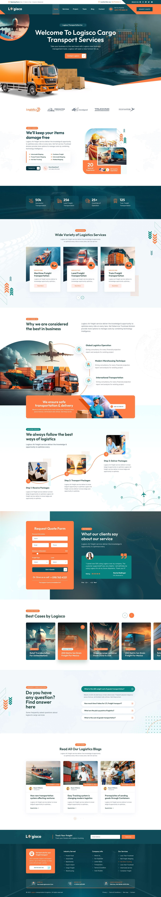

# JW Allround WordPress Block Theme

Et alsidigt, moderne og responsivt WordPress tema bygget med blokredigering. Perfekt til virksomhedshjemmesider, blogs og portfolier.

## Funktioner

- **Fuldt blokbaseret tema**: Fuld støtte til WordPress' block editor (Gutenberg)
- **Responsive Design**: Tilpasser sig perfekt til alle skærmstørrelser
- **Customization Options**: Tilpas farver, typografi og layout via theme.json
- **Optimeret performance**: Hurtig indlæsning og effektiv kodebase
- **Blokmønstre**: Forhåndsdefinerede blokmønstre til nem opbygning af sider
- **SEO-venlig**: Følger bedste praksis for søgemaskineoptimering
- **Browser-kompatibilitet**: Fungerer i alle moderne browsere

## Installation

1. Download tema-arkivet 
2. Log ind på din WordPress-admin
3. Gå til Udseende > Temaer > Tilføj nyt
4. Klik på "Upload tema"
5. Vælg den downloadede zip-fil og klik på "Installér nu"
6. Aktivér temaet efter installation

## Anvendelse

### Tilpasning af temaet

JW Allround temaet kan nemt tilpasses ved hjælp af WordPress' indbyggede blokredigering og tilpasningsmuligheder:

1. **Farver og typografi**: Juster via Site Editor > Styles
2. **Sidelayout**: Brug blokredigering til at arrangere og tilpasse indhold
3. **Blokmønstre**: Find JW Allround-mønstre i blokredigering under "Mønstre"

### Blokmønstre

Temaet indeholder følgende færdige blokmønstre:

- **Hero Section**: Skab visuelle headerområder med tekst og knapper
- **Services Grid**: Vis dine tjenester i et organiseret grid-layout
- **Feature Section**: Fremhæv nøglefunktioner med billeder og tekst
- **Steps Timeline**: Vis processer eller trin i en struktureret, visuel måde
- **Testimonials**: Vis kundeanmeldelser i et attraktivt layout
- **FAQ Accordion**: Opret en udvidbar FAQ-sektion
- **Logo Carousel**: Vis partnere eller kunder i et grid
- **Contact Form**: Et layout til kontaktformular (kræver kontaktformular-plugin)

### Skabeloner

JW Allround inkluderer følgende skabeloner:

- **Forside (page-home.html)**: Skabelon specielt designet til forsider
- **Standardside (page.html)**: For alle almindelige sider
- **Blog (index.html)**: Til blogindlæg/listevisning
- **Enkelt indlæg (single.html)**: Til visning af enkelt blogindlæg
- **Arkiv (archive.html)**: Til kategori- og tag-arkiver
- **404 (404.html)**: Fejlside for "Side ikke fundet"

## Krav

- WordPress 5.9 eller nyere
- PHP 7.4 eller nyere

## Tilpasning

For avancerede tilpasninger kan du:

1. Oprette et underordnet tema (child theme)
2. Redigere theme.json for globale stilarter
3. Tilføje tilpasset CSS i Site Editor > Styles > Additional CSS

## Credits

- Font: Hind Siliguri
- Udviklet af [Dit navn]

## Support

For support og spørgsmål, kontakt venligst [kontaktinformation]

## Licens

Dette tema er licenseret under GNU General Public License v2 eller senere.

---

Tak for at bruge JW Allround temaet!
